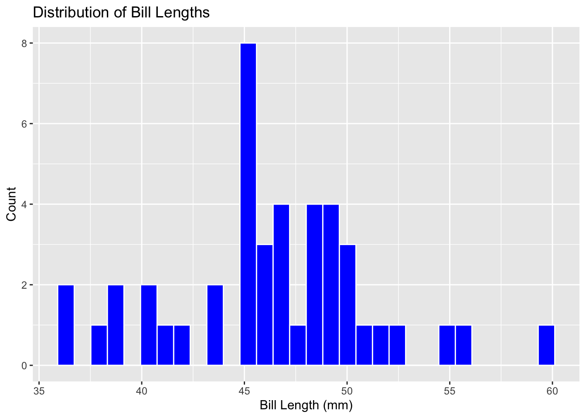

## Palmer Penguins

Creating and rendering a Quarto document containing an analysis on the palmerpenguins data into a reproducible report. Then making a local repository in GitHub.


::: {.cell}

```{.r .cell-code}
library(tidyverse)
```

::: {.cell-output .cell-output-stderr}

```
── Attaching core tidyverse packages ──────────────────────── tidyverse 2.0.0 ──
✔ dplyr     1.1.4     ✔ readr     2.1.5
✔ forcats   1.0.0     ✔ stringr   1.5.1
✔ ggplot2   3.5.1     ✔ tibble    3.2.1
✔ lubridate 1.9.4     ✔ tidyr     1.3.1
✔ purrr     1.0.2     
── Conflicts ────────────────────────────────────────── tidyverse_conflicts() ──
✖ dplyr::filter() masks stats::filter()
✖ dplyr::lag()    masks stats::lag()
ℹ Use the conflicted package (<http://conflicted.r-lib.org/>) to force all conflicts to become errors
```


:::

```{.r .cell-code}
penguins<-read_csv("https://raw.githubusercontent.com/mcduryea/Intro-to-Bioinformatics/main/data/penguins_samp1.csv")
```

::: {.cell-output .cell-output-stderr}

```
Rows: 44 Columns: 8
── Column specification ────────────────────────────────────────────────────────
Delimiter: ","
chr (3): species, island, sex
dbl (5): bill_length_mm, bill_depth_mm, flipper_length_mm, body_mass_g, year

ℹ Use `spec()` to retrieve the full column specification for this data.
ℹ Specify the column types or set `show_col_types = FALSE` to quiet this message.
```


:::

```{.r .cell-code}
penguins %>% head()
```

::: {.cell-output .cell-output-stdout}

```
# A tibble: 6 × 8
  species island bill_length_mm bill_depth_mm flipper_length_mm body_mass_g
  <chr>   <chr>           <dbl>         <dbl>             <dbl>       <dbl>
1 Gentoo  Biscoe           59.6          17                 230        6050
2 Gentoo  Biscoe           48.6          16                 230        5800
3 Gentoo  Biscoe           52.1          17                 230        5550
4 Gentoo  Biscoe           51.5          16.3               230        5500
5 Gentoo  Biscoe           55.1          16                 230        5850
6 Gentoo  Biscoe           49.8          15.9               229        5950
# ℹ 2 more variables: sex <chr>, year <dbl>
```


:::
:::


We loaded the tidyverse, read the penguins_samp1 csv data file from Dr. Duryea github and then ran a line to see the first six rows of the data read into the Quarto notebook.

## Data Manipulation

Learning how to manipulate R code to manipulate data. Focusing on filtering rows, subset columns, group data, and compute summary statistics. Side focus is narrating/explaining the workflow during this assignment with a specific interest in using tidy analyses in R with Palmer Penguins data.

-   are there other islands in this data set that have comparison data from the same species?

-   is there a positive/negative correlation between body mass and the other body characteristics?

-   are there trends present in the data frame that would allow for further research?

### DM and Summarization

Building frequency tables in R with the count() to summarize categorical variables. Numerical variables more options, measures of average and measures of spread.

counts for categorical data (forgot to load the tidyverse library and need to pay more attention to capitalizations)


::: {.cell}

```{.r .cell-code}
penguins %>% 
  count(island)
```

::: {.cell-output .cell-output-stdout}

```
# A tibble: 3 × 2
  island        n
  <chr>     <int>
1 Biscoe       36
2 Dream         3
3 Torgersen     5
```


:::

```{.r .cell-code}
penguins %>%
  count(island)
```

::: {.cell-output .cell-output-stdout}

```
# A tibble: 3 × 2
  island        n
  <chr>     <int>
1 Biscoe       36
2 Dream         3
3 Torgersen     5
```


:::

```{.r .cell-code}
library(tidyverse)
penguins %>% 
  count(island)
```

::: {.cell-output .cell-output-stdout}

```
# A tibble: 3 × 2
  island        n
  <chr>     <int>
1 Biscoe       36
2 Dream         3
3 Torgersen     5
```


:::
:::


Interpret the output: There are three islands with specific numbers of penguins on each represented in the "n" column in this frequency table.


::: {.cell}

```{.r .cell-code}
penguins %>%
  count(species)
```

::: {.cell-output .cell-output-stdout}

```
# A tibble: 3 × 2
  species       n
  <chr>     <int>
1 Adelie        9
2 Chinstrap     2
3 Gentoo       33
```


:::
:::


Interpret the output: there are three species, and Gentoo species of penguins appear to have the highest population in this frequency table.


::: {.cell}

```{.r .cell-code}
penguins %>% count(island, species)
```

::: {.cell-output .cell-output-stdout}

```
# A tibble: 5 × 3
  island    species       n
  <chr>     <chr>     <int>
1 Biscoe    Adelie        3
2 Biscoe    Gentoo       33
3 Dream     Adelie        1
4 Dream     Chinstrap     2
5 Torgersen Adelie        5
```


:::
:::


ITO: Three islands with species shown in a frequency graph. Biscoe has the highest number of individuals, Torgerson follows, and Dream has the lowest number of penguin species. Chinstrap are present only on Dream, Adelie are present on all three islands and Gentoo are present on Biscoe only.

#### Practicing more readable versions of output


::: {.cell}

```{.r .cell-code}
penguins %>% 
  count(island, species) %>%
  pivot_wider(names_from = species, values_from = n, values_fill = 0)
```

::: {.cell-output .cell-output-stdout}

```
# A tibble: 3 × 4
  island    Adelie Gentoo Chinstrap
  <chr>      <int>  <int>     <int>
1 Biscoe         3     33         0
2 Dream          1      0         2
3 Torgersen      5      0         0
```


:::
:::


Pro tip: When installing kableExtra use the "".


::: {.cell}

```{.r .cell-code}
library(kableExtra)
```

::: {.cell-output .cell-output-stderr}

```

Attaching package: 'kableExtra'
```


:::

::: {.cell-output .cell-output-stderr}

```
The following object is masked from 'package:dplyr':

    group_rows
```


:::

```{.r .cell-code}
penguins %>%
  count(island, species) %>%
  pivot_wider(names_from = species, values_from = n, values_fill = 0) %>%
  kable() %>%
  kable_styling(bootstrap_options = c("hover", "striped"))
```

::: {.cell-output-display}

`````{=html}
<table class="table table-hover table-striped" style="margin-left: auto; margin-right: auto;">
 <thead>
  <tr>
   <th style="text-align:left;"> island </th>
   <th style="text-align:right;"> Adelie </th>
   <th style="text-align:right;"> Gentoo </th>
   <th style="text-align:right;"> Chinstrap </th>
  </tr>
 </thead>
<tbody>
  <tr>
   <td style="text-align:left;"> Biscoe </td>
   <td style="text-align:right;"> 3 </td>
   <td style="text-align:right;"> 33 </td>
   <td style="text-align:right;"> 0 </td>
  </tr>
  <tr>
   <td style="text-align:left;"> Dream </td>
   <td style="text-align:right;"> 1 </td>
   <td style="text-align:right;"> 0 </td>
   <td style="text-align:right;"> 2 </td>
  </tr>
  <tr>
   <td style="text-align:left;"> Torgersen </td>
   <td style="text-align:right;"> 5 </td>
   <td style="text-align:right;"> 0 </td>
   <td style="text-align:right;"> 0 </td>
  </tr>
</tbody>
</table>

`````

:::
:::


### Summaries for Numerical Data

Measures of center, spread/other metric


::: {.cell}

```{.r .cell-code}
penguins %>%
  summarize(mean_bill_length_mm = mean(bill_length_mm))
```

::: {.cell-output .cell-output-stdout}

```
# A tibble: 1 × 1
  mean_bill_length_mm
                <dbl>
1                46.4
```


:::
:::


Missing values, if we try to compute quantity, result will be NA because some of the values are missing. Code below tells R to ignore NA values.


::: {.cell}

```{.r .cell-code}
penguins %>%
  summarize(mean_bill_length_mm = mean(bill_length_mm, na.rm = TRUE))
```

::: {.cell-output .cell-output-stdout}

```
# A tibble: 1 × 1
  mean_bill_length_mm
                <dbl>
1                46.4
```


:::
:::


Including the median, standard deviation, minimum, 25th percentile, 75th percentile, maximum bill lengths.


::: {.cell}

```{.r .cell-code}
penguins %>%
  summarize(
    min_bill_length = min(bill_length_mm, na.rm = TRUE),
    first_quartile_bill_length = quantile(bill_length_mm, 0.25, na.rm = TRUE),
    median_bill_length = median(bill_length_mm, na.rm = TRUE),
    mean_bill_length_mm = mean(bill_length_mm, na.rm = TRUE),
    third_quartile_bill_length = quantile(bill_length_mm, 0.75, na.rm = TRUE),
    standard_deviation_bill_length = sd(bill_length_mm, na.rm = TRUE)
    ) %>%
  pivot_longer(cols = everything())
```

::: {.cell-output .cell-output-stdout}

```
# A tibble: 6 × 2
  name                           value
  <chr>                          <dbl>
1 min_bill_length                36.2 
2 first_quartile_bill_length     44.6 
3 median_bill_length             46.4 
4 mean_bill_length_mm            46.4 
5 third_quartile_bill_length     49.1 
6 standard_deviation_bill_length  4.93
```


:::
:::


Last line pivot_longer, converts table from being very wide to long table. Cannot currently get the kable() to work.

## Selecting Specific Rows and Columns

Can select specific columns using select() or rows satisfying certain conditions using filter(). Can select only the species, island, sex and year columns.


::: {.cell}

```{.r .cell-code}
penguins %>%
  select(species, island, sex, year)
```

::: {.cell-output .cell-output-stdout}

```
# A tibble: 44 × 4
   species island sex    year
   <chr>   <chr>  <chr> <dbl>
 1 Gentoo  Biscoe male   2007
 2 Gentoo  Biscoe male   2008
 3 Gentoo  Biscoe male   2009
 4 Gentoo  Biscoe male   2009
 5 Gentoo  Biscoe male   2009
 6 Gentoo  Biscoe male   2009
 7 Gentoo  Biscoe male   2008
 8 Gentoo  Biscoe male   2009
 9 Gentoo  Biscoe male   2008
10 Gentoo  Biscoe male   2007
# ℹ 34 more rows
```


:::
:::


Can also filter() dataset for only Chinstrap penguins.


::: {.cell}

```{.r .cell-code}
penguins %>%
  select(species, island, sex, year) %>%
  filter(species == "Chinstrap")
```

::: {.cell-output .cell-output-stdout}

```
# A tibble: 2 × 4
  species   island sex     year
  <chr>     <chr>  <chr>  <dbl>
1 Chinstrap Dream  male    2009
2 Chinstrap Dream  female  2007
```


:::
:::


Showing how to deselect columns using the select() func and - sign in front of column name. Makes a smaller data frame. Troubleshooting was needed when copying code from the document as the object was not recognized, the object name threw errors until the name was changed to "Chinstrap %\>%"


::: {.cell}

```{.r .cell-code}
Chinstrap <- penguins %>%
  select(species, island, sex, year) %>%
  filter(species == "Chinstrap") %>%
  select(-species)
Chinstrap %>%
  head()
```

::: {.cell-output .cell-output-stdout}

```
# A tibble: 2 × 3
  island sex     year
  <chr>  <chr>  <dbl>
1 Dream  male    2009
2 Dream  female  2007
```


:::
:::


### Grouping and Summarizing Groups

Using group_by() and summarize() to compare summary statistics across groups. I used the bill_depth_mm to compare the average and standard deviation across species group and also to practice grouping and summarize groups.


::: {.cell}

```{.r .cell-code}
penguins %>%
  group_by(species) %>%
  summarise(
    mean_bill_depth_mm = mean(bill_depth_mm, na.rm = TRUE),
    sd_bill_depth_mm = sd(bill_depth_mm, na.rm = TRUE)
  )
```

::: {.cell-output .cell-output-stdout}

```
# A tibble: 3 × 3
  species   mean_bill_depth_mm sd_bill_depth_mm
  <chr>                  <dbl>            <dbl>
1 Adelie                  17.8            0.935
2 Chinstrap               18.8            1.41 
3 Gentoo                  15.2            0.951
```


:::
:::


IOD: Chinstrap has the largest mean bill depth, followed by Adelie, and Gentoo. Chinstrap has the largest standard deviation, while Gentoo has the second largest STD with the smallest mean bill depth. Adelie has the smallest STD with the second largest mean bill depth. The larger STD has more variable bill lengths, and probably a broader distribution curve. The smaller STD (Adelie) may have a less broad distribution curve and less of a variation on bill depth than the Chinstrap or Gentoo.

### Data visualization with ggplot()

#### Using one category variable: ex uses a barplot.


::: {.cell}

```{.r .cell-code}
penguins %>%
  ggplot() +
  geom_bar(mapping = aes(x = species)) +
  labs(title ="Counts of Penguin Species",
       x = "Species", y = "Count")
```

::: {.cell-output-display}
{width=672}
:::
:::


Data visualization with one categorical variable using ggplot(). Using a barplot, the visual shows that Gentoo have the largest individuals count per species, with Adelie and then Chinstrap. The + is being used to connect and add additional layers to the function. Allows for ggplot to be customized based on layer function and at what step the layer function is being added.


::: {.cell}

```{.r .cell-code}
penguins %>%
  ggplot() +
  geom_bar(mapping = aes(x = flipper_length_mm)) +
  labs(title ="Counts of Flipper Length in mm",
       x = "flipper_length_mm", y = "Count")
```

::: {.cell-output-display}
{width=672}
:::
:::


Will need to label the species for each flipper length and group these variables to get further information out of the data visualization.

#### One numerical variable: using histogram (geom_histogram()), density (geom_density()), boxplot (geom_boxplot()).


::: {.cell}

```{.r .cell-code}
penguins %>%
  ggplot() +
  geom_histogram(mapping = aes(x = bill_length_mm), color = "white", fill = "blue") + 
  labs(title ="Distribution of Bill Lengths", x = "Bill Length (mm)", y = "Count")
```

::: {.cell-output .cell-output-stderr}

```
`stat_bin()` using `bins = 30`. Pick better value with `binwidth`.
```


:::

::: {.cell-output-display}
{width=672}
:::
:::


There is some confusion when looking to see what the bill length is as these values have multiple significant figures to increase precision for bill length measurement. The histogram shows visual distribution well and is able to be understood at a glance.

Changing to a boxplot does not give further information as the distribution is gone. The histogram is better with visual distribution as the columns show count clearly, while the density visual is the best at showing the distribution of bill lengths but is slightly lacking in finding the count quickly.


::: {.cell}

```{.r .cell-code}
penguins %>%
  ggplot() +
  geom_density(mapping = aes(x = bill_length_mm),
                 color = "white",
                 fill = "blue") +
  labs(title ="Distribution of Bill Lengths",
       x = "Bill Length (mm)", y = "Count")
```

::: {.cell-output-display}
{width=672}
:::
:::


#### Two Numerical Variables: exploring relationship with a scatterplot


::: {.cell}

```{.r .cell-code}
penguins%>%
  ggplot() + 
  geom_point(mapping = aes(x = bill_depth_mm, y = bill_length_mm)) +
  labs(title = "Bill Depth and Length", x = "Bill Depth (mm)", y = "Bill Length (mm)")
```

::: {.cell-output-display}
{width=672}
:::
:::


There is higher density around bill depth/length 16, 50.

Flipper length vs body mass. Wanted to see if there was a potential relationship.


::: {.cell}

```{.r .cell-code}
penguins %>%
  ggplot() +
  geom_point(mapping = aes(x = flipper_length_mm, y = body_mass_g)) +
  labs(title = "Flipper Length and Body Mass",
       x = "Flipper Length (mm)",
       y = "Body Mass (g)")
```

::: {.cell-output-display}
{width=672}
:::
:::


#### Two Categorical Variables: relationships between pairs of categorical variables w barplots and fill.


::: {.cell}

```{.r .cell-code}
penguins %>%
  ggplot() +
  geom_bar(mapping = aes(x = island, fill = species)) +
  labs(title = "Species by Island", x = "Island", y = "Species")
```

::: {.cell-output-display}
{width=672}
:::
:::


Great visualization. Can see the adding of the function working to construct the different associations between two categorical variables in the layers present. The lowercase 'species' could. potentially be changed but then the object would throw an error and not be found?

#### One Numerical and One Categorical Variable: visualization to compare numerical and categorical variables using boxplots or faceted plots.


::: {.cell}

```{.r .cell-code}
penguins %>%
  ggplot() +
  geom_boxplot(mapping = aes(x = bill_depth_mm, y = species)) +
  labs(title = "Bill Depth by Species", x = "Bill Depth (mm)", y = "")
```

::: {.cell-output-display}
{width=672}
:::
:::

::: {.cell}

```{.r .cell-code}
penguins %>%
  ggplot() +
  geom_histogram(mapping = aes(x = bill_length_mm)) +
  facet_wrap(~species, ncol = 1) +
  labs(title = "Bill Depth by Species", x = "Bill Depth (mm)", y = "")
```

::: {.cell-output .cell-output-stderr}

```
`stat_bin()` using `bins = 30`. Pick better value with `binwidth`.
```


:::

::: {.cell-output-display}
{width=672}
:::
:::


The histogram is less specific and shows the visual spread and the range-count. The boxplot is visually specific and displays data using the five-number summary.

### Advanced Plotting: building more complex plots


::: {.cell}

```{.r .cell-code}
penguins %>%
  filter(!is.na(sex)) %>%
  ggplot() +
  geom_point(mapping = aes(x = bill_length_mm, 
                           y = flipper_length_mm,
                           color = species,
                           shape = sex)) +
  geom_smooth(mapping = aes(x = bill_length_mm,
                            y = flipper_length_mm,
                            color = species),
              method = "lm") +
  facet_grid(island ~ sex, scales = "free") +
  labs(title = "Flipper and Bill Lengths by Species and Sex",
       x = "Bill Length (mm)",
       y = "Flipper Length(mm)") +
  theme_light()
```

::: {.cell-output .cell-output-stderr}

```
`geom_smooth()` using formula = 'y ~ x'
```


:::

::: {.cell-output .cell-output-stderr}

```
Warning in qt((1 - level)/2, df): NaNs produced
Warning in qt((1 - level)/2, df): NaNs produced
```


:::

::: {.cell-output .cell-output-stderr}

```
Warning in max(ids, na.rm = TRUE): no non-missing arguments to max; returning
-Inf
Warning in max(ids, na.rm = TRUE): no non-missing arguments to max; returning
-Inf
```


:::

::: {.cell-output-display}
{width=672}
:::
:::


Breaking down the code,

-   filter is keeping the rows that fit the function, and is searching for missing variables, the ! in R stands for not, so it is saying to filter not applicable missing variable sex.

-   ggplot creates a scatterplot,

-   geom_point creates a scatterplot and overlays a loess trendline. geom_smooth overlays the data and creates the shadow visuals on the data frame. 'Aes' functions in the () are a static aesthetic that apply to the layer. scale to show the data being represented on the graph. Color and shape are another scale pair.

-   facet_grid breaks down the smaller subsets of data, seeing this where the facet is comparing island \~ sex.

-   labs is labeling and titling everything in the visual.

-   theme_light works with the visual of the plot and controls the coloration, and customizations.

## Final Question:

The average bill length is 46.37 mm, and does exceed 45 mm. I am only able to answer for a subset of penguins as this data is based on the three species across an area of three islands. I am certain that the average length of bills exceeds 45 mm in this subset of penguins.

### Summary

-   Are there other islands in this data set that have comparison data from the same species?

    -   Cannot answer this with current data.

-   Is there a positive or negative correlation between body mass and the other body characteristics?

    -   Positive correlation between body mass and flipper length. Other body characteristics will have to be run to determine if there is any correlation.


::: {.cell}

```{.r .cell-code}
penguins %>%
  ggplot() +
  geom_point(mapping = aes(x = flipper_length_mm, y = body_mass_g)) + 
  labs(title = "Flipper Length and Body Mass",
       x = "Flipper Length (mm)",
       y = "Body Mass (g)")
```

::: {.cell-output-display}
{width=672}
:::
:::
